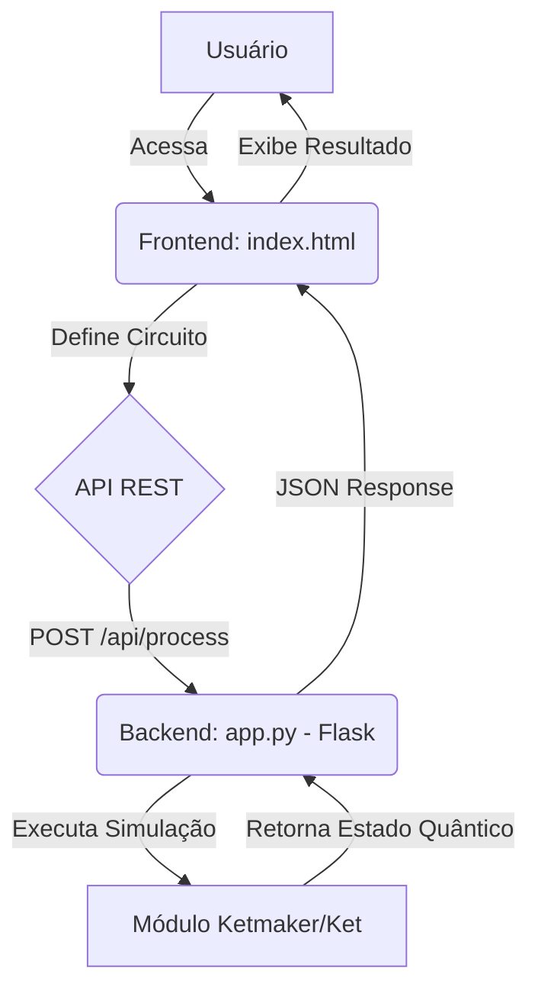

# 📄 Documento de Detalhamento de Software (DDS) - KetMaker

Este documento detalha a arquitetura, o ambiente de desenvolvimento e a estrutura do projeto **KetMaker**, desenvolvido para a disciplina DEC0013-04655 (20252) – Projeto Integrador I.

---

## 1. Descrição Geral do Sistema

### Objetivo do Software

O **KetMaker** é uma aplicação web interativa desenvolvida com o objetivo de **simular e visualizar circuitos quânticos** de forma didática e acessível. Ele permite que o usuário componha um circuito quântico arrastando e soltando *gates* (portas lógicas quânticas) em *qubits* (bits quânticos) e, em seguida, execute a simulação para visualizar o estado final do sistema.

### Principais Funcionalidades

| Funcionalidade | Descrição |
| :--- | :--- |
| **Composição de Circuitos** | Interface de arrastar e soltar para montar circuitos quânticos. |
| **Suporte a Gates** | Implementação de portas quânticas fundamentais (X, Y, Z, H) e portas controladas (CNOT). |
| **Simulação em Tempo Real** | Execução do circuito quântico no backend e retorno do estado final do sistema. |
| **Visualização do Estado** | Apresentação do estado quântico final em formato de texto e notação LaTeX. |
| **Gerenciamento de Qubits** | Adição e remoção dinâmica de qubits na interface. |

### Arquitetura Geral

O KetMaker adota uma **Arquitetura Cliente-Servidor** simples, com uma clara separação de responsabilidades:

*   **Frontend (Cliente):** Responsável pela Interface do Usuário (UI), lógica de interação (arrastar e soltar) e comunicação com o Backend via API REST.
*   **Backend (Servidor):** Responsável por receber a definição do circuito, executar a simulação quântica e retornar o resultado.

A arquitetura pode ser classificada como **Monolítica** em termos de implantação, mas com separação lógica entre as camadas de apresentação e processamento.

### Diagrama de Arquitetura



---

## 2. Ambiente de Desenvolvimento

| Componente | Detalhe |
| :--- | :--- |
| **Sistema Operacional** | Independente (Desenvolvido e testado em ambiente Linux/Ubuntu) |
| **Linguagem Backend** | Python 3.x (Recomendado: 3.10+) |
| **IDE/Editor** | VSCode (Visual Studio Code) - *Recomendado* |
| **Ferramentas Adicionais** | Git, GitHub CLI, Ambiente Virtual Python (`venv`) |

---

## 3. Dependências

O projeto possui dependências distintas para o Frontend e o Backend.

### Backend (Python)

O backend utiliza o framework Flask para o servidor web e a biblioteca `ket` para a simulação quântica.

| Biblioteca | Versão (Exemplo) | Propósito |
| :--- | :--- | :--- |
| **Flask** | `~= 3.0.3` | Framework web para criação da API REST. |
| **Flask-CORS** | `~= 4.0.1` | Habilita o *Cross-Origin Resource Sharing* (CORS) para comunicação com o Frontend. |
| **Ket** | `~= 1.0.0` | Biblioteca de simulação de computação quântica. |

### Frontend (Web)

O frontend é composto por arquivos estáticos, utilizando bibliotecas de terceiros via CDN (Content Delivery Network).

| Biblioteca | Versão | Propósito |
| :--- | :--- | :--- |
| **Tailwind CSS** | `3.x` | Framework CSS utilitário para estilização da interface. |
| **KaTeX** | `0.16.9` | Biblioteca para renderização de notação matemática (LaTeX) para exibir o estado quântico. |

---

## 4. Instalação

O passo a passo detalhado para a instalação e configuração do ambiente está documentado no arquivo **`INSTALL.md`** na raiz do repositório.

### Pré-requisitos

*   Python 3.x
*   Git

### Comandos Principais

```bash
# Clonar o repositório
git clone https://github.com/danilosramos/KetMaker.git
cd KetMaker

# Instalar dependências (após criar o requirements.txt)
pip install -r requirements.txt

# Executar o servidor
flask run
```

---

## 5. Configuração

### Como Rodar o Projeto Localmente

1.  Siga os passos de instalação em `INSTALL.md`.
2.  Ative o ambiente virtual.
3.  Defina as variáveis de ambiente (se necessário, conforme `INSTALL.md`).
4.  Execute o comando `flask run` no diretório raiz do projeto.

### Configuração de Banco de Dados

O projeto **não utiliza banco de dados** persistente. O estado da simulação é mantido em memória durante a execução do circuito quântico.

### Como Executar Testes Automatizados

Atualmente, o projeto **não possui testes automatizados** implementados. Esta é uma funcionalidade a ser desenvolvida em futuras iterações.

---

## 6. Estrutura do Código

A estrutura do código segue o padrão definido pelo template, com o código-fonte do projeto na pasta `software/`.

```
KetMaker/
├── 📁 software/
│   ├── 📁 backend/
│   │   ├── 📄 app.py          # Ponto de entrada da aplicação Flask e definição da API.
│   │   ├── 📄 ketmaker.py     # Módulo principal que orquestra a simulação quântica.
│   │   └── ...
│   └── 📁 frontend/
│       └── 📄 index.html      # Interface do usuário (HTML, CSS, JavaScript).
├── 📁 docs/
│   └── 📁 requisitos/
│       └── 📄 Requisitos_de_Software.pdf # Documento original.
├── 📄 README.md
├── 📄 INSTALL.md
└── ...
```

### Breve Descrição de Cada Módulo

*   **`software/backend/app.py`**:
    *   Inicializa a aplicação Flask e o CORS.
    *   Define o único endpoint da API (`/api/process`).
    *   Recebe a requisição do Frontend e chama a lógica de simulação.
*   **`software/backend/ketmaker.py`**:
    *   Contém a lógica de conversão da estrutura de dados do Frontend para a estrutura da biblioteca `ket`.
    *   Responsável por montar e executar o circuito quântico.
*   **`software/frontend/index.html`**:
    *   Contém toda a estrutura HTML, CSS (Tailwind) e JavaScript do lado do cliente.
    *   Gerencia a interface de arrastar e soltar.
    *   Envia a definição do circuito para o Backend.

---

## 7. Interface

### Prints das Telas do Sistema

*(Neste ponto, o documento seria complementado com capturas de tela da interface principal, da paleta de gates e da área de resultados. Exemplo de legenda: "Figura 1: Interface principal do KetMaker, mostrando a área de composição do circuito e a paleta de gates.")*

### Fluxo de Navegação

O KetMaker é uma aplicação de página única (SPA - Single Page Application) com um fluxo de interação linear:

1.  **Acesso:** O usuário acessa a URL principal (`http://127.0.0.1:5000/`).
2.  **Composição:** O usuário arrasta *gates* da paleta para as linhas de *qubits* na área do circuito.
3.  **Execução:** O usuário clica no botão **"Run Circuit"** (Executar Circuito).
4.  **Resultado:** O resultado da simulação (estado quântico) é exibido em uma seção dedicada na interface.

---

## 8. APIs

O Backend expõe uma única API REST para processamento do circuito quântico.

### Endpoint: `/api/process`

| Detalhe | Descrição |
| :--- | :--- |
| **Método** | `POST` |
| **URL** | `/api/process` |
| **Propósito** | Envia a definição do circuito quântico para o servidor para simulação. |

#### Exemplo de Requisição (JSON)

```json
{
    "qubits": {
        "q0": [0, 0],
        "q1": [0, 0]
    },
    "gates": {
        "0": [
            {"type": "H", "qubit": "q0"},
            {"type": "Control", "qubit": "q0"},
            {"type": "Target", "qubit": "q1"}
        ]
    }
}
```

#### Exemplo de Resposta (JSON)

```json
{
    "state": {
        "|00>": "0.7071067811865475",
        "|11>": "0.7071067811865475"
    },
    "latex": "\\frac{1}{\\sqrt{2}} \\left( |00\\rangle + |11\\rangle \\right)"
}
```
