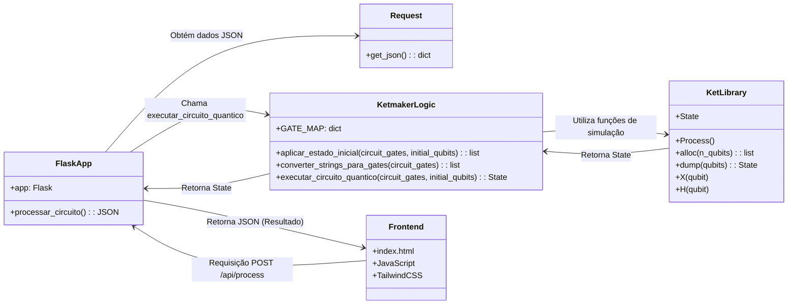

# 📐 Diagrama de Classes UML - KetMaker

Este diagrama de classes representa a estrutura do Backend do projeto **KetMaker**, focando nas classes e funções principais.

```mermaid
classDiagram
    direction LR
    
    class FlaskApp {
        +app: Flask
        +processar_circuito(): JSON
    }
    
    class Request {
        +get_json(): dict
    }
    
    class KetmakerLogic {
        +GATE_MAP: dict
        +aplicar_estado_inicial(circuit_gates, initial_qubits): list
        +converter_strings_para_gates(circuit_gates): list
        +executar_circuito_quantico(circuit_gates, initial_qubits): State
    }
    
    class KetLibrary {
        +Process()
        +alloc(n_qubits): list<Qubit>
        +dump(qubits): State
        +X(qubit)
        +H(qubit)
        +State
    }
    
    class Frontend {
        +index.html
        +JavaScript
        +TailwindCSS
    }
    
    Frontend --> FlaskApp: Requisição POST /api/process
    FlaskApp --> Request: Obtém dados JSON
    FlaskApp --> KetmakerLogic: Chama executar_circuito_quantico
    KetmakerLogic --> KetLibrary: Utiliza funções de simulação
    KetLibrary --> KetmakerLogic: Retorna State
    KetmakerLogic --> FlaskApp: Retorna State
    FlaskApp --> Frontend: Retorna JSON (Resultado)
```
