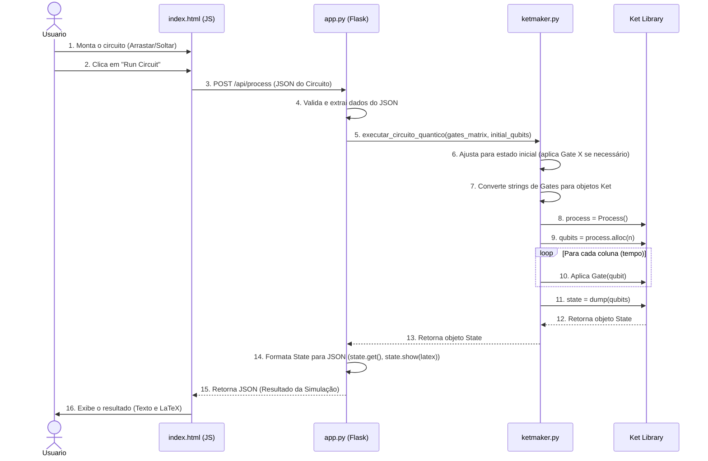

# ⏳ Diagrama de Sequência UML - KetMaker

Este diagrama de sequência ilustra o fluxo de comunicação e a ordem das operações para a execução de um circuito quântico, desde a interação do usuário até a simulação no Backend.

