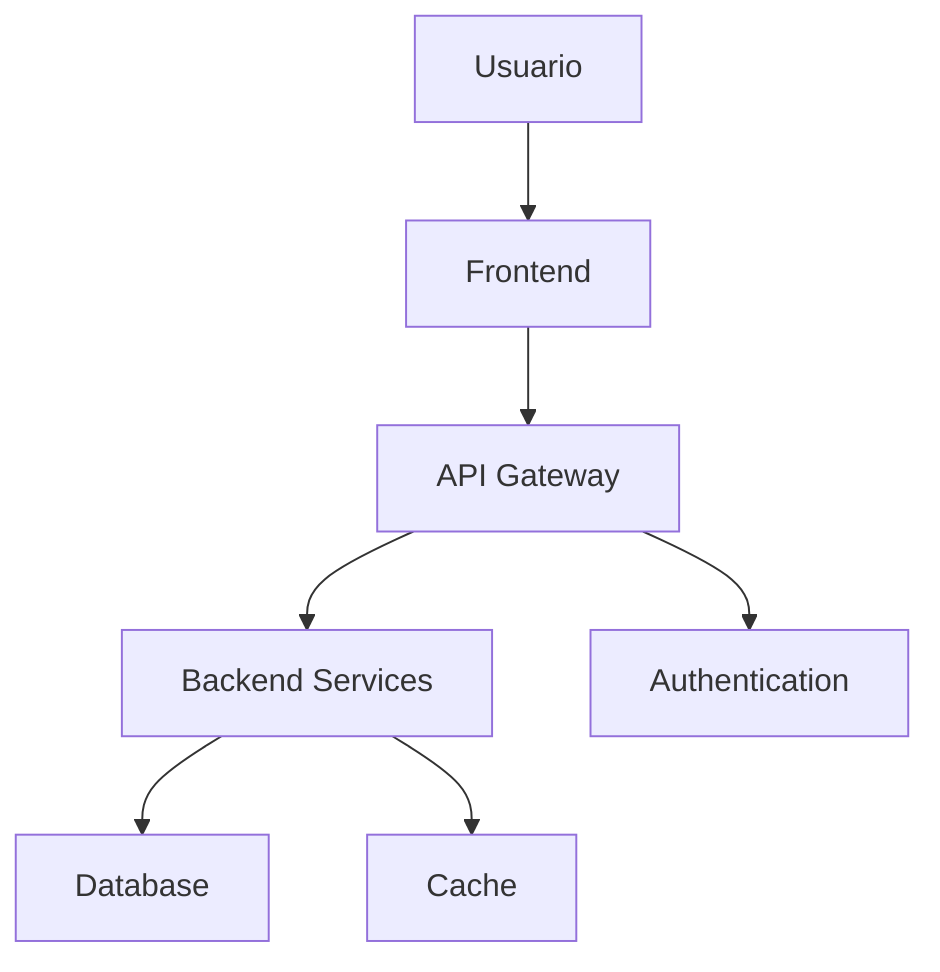

# Documentação do Projeto

> 📚 **Documentação técnica completa e guias do usuário**

## 📋 Visão Geral

A documentação é fundamental para o sucesso de qualquer projeto de software. Esta pasta contém toda a documentação técnica, guias de usuário, especificações, diagramas e materiais de apoio para desenvolvedores, usuários e stakeholders.

## 🏗️ Estrutura Recomendada

```
docs/
├── 📁 architecture/            # Arquitetura e design do sistema
│   ├── 📄 system-overview.md   # Visão geral do sistema
│   ├── 📄 components.md        # Componentes e módulos
│   ├── 📄 data-flow.md         # Fluxo de dados
│   ├── 📄 security.md          # Arquitetura de segurança
│   └── 📁 diagrams/            # Diagramas técnicos
├── 📁 api/                     # Documentação de APIs
│   ├── 📄 overview.md          # Visão geral das APIs
│   ├── 📄 authentication.md    # Autenticação e autorização
│   ├── 📄 endpoints.md         # Lista de endpoints
│   ├── 📄 examples.md          # Exemplos de uso
│   └── 📄 openapi.yaml         # Especificação OpenAPI
├── 📁 user-guide/              # Manual do usuário
│   ├── 📄 getting-started.md   # Primeiros passos
│   ├── 📄 features.md          # Funcionalidades
│   ├── 📄 tutorials.md         # Tutoriais passo-a-passo
│   ├── 📄 faq.md               # Perguntas frequentes
│   └── 📁 screenshots/         # Capturas de tela
├── 📁 development/             # Guias para desenvolvedores
│   ├── 📄 setup.md             # Configuração do ambiente
│   ├── 📄 coding-standards.md  # Padrões de código
│   ├── 📄 testing.md           # Estratégias de teste
│   ├── 📄 deployment.md        # Guia de deploy
│   └── 📄 troubleshooting.md   # Solução de problemas
├── 📁 requirements/            # Requisitos e especificações
│   ├── 📄 functional.md        # Requisitos funcionais
│   ├── 📄 non-functional.md    # Requisitos não-funcionais
│   ├── 📄 user-stories.md      # Histórias de usuário
│   └── 📄 acceptance-criteria.md # Critérios de aceitação
├── 📁 design/                  # Design e UX
│   ├── 📄 style-guide.md       # Guia de estilo
│   ├── 📄 ui-components.md     # Componentes de UI
│   ├── 📄 wireframes.md        # Wireframes
│   └── 📁 assets/              # Assets de design
├── 📁 operations/              # Operações e infraestrutura
│   ├── 📄 monitoring.md        # Monitoramento
│   ├── 📄 logging.md           # Sistema de logs
│   ├── 📄 backup.md            # Estratégia de backup
│   └── 📄 disaster-recovery.md # Plano de recuperação
├── 📄 README.md                # Este arquivo
├── 📄 CHANGELOG.md             # Histórico de mudanças
└── 📄 GLOSSARY.md              # Glossário de termos
```

## 📖 Tipos de Documentação

### **1. Documentação Técnica** 🔧

**Arquitetura do Sistema**
- Visão geral da arquitetura
- Diagramas de componentes
- Fluxo de dados
- Decisões arquiteturais (ADRs)
- Padrões utilizados

**Documentação de APIs**
- Especificações OpenAPI/Swagger
- Exemplos de requisições/respostas
- Códigos de erro
- Rate limiting e autenticação
- SDKs e bibliotecas cliente

**Código e Implementação**
- Padrões de código
- Documentação inline (docstrings)
- Guias de contribuição
- Setup de ambiente de desenvolvimento

### **2. Documentação de Usuário** 👥

**Manual do Usuário**
- Getting started guide
- Tutoriais passo-a-passo
- Funcionalidades detalhadas
- Capturas de tela atualizadas
- Vídeos explicativos

**FAQ e Suporte**
- Perguntas frequentes
- Problemas comuns e soluções
- Canais de suporte
- Base de conhecimento

### **3. Documentação de Processo** 📋

**Requisitos e Especificações**
- Requisitos funcionais
- Requisitos não-funcionais
- Casos de uso
- Histórias de usuário
- Critérios de aceitação

**Processo de Desenvolvimento**
- Metodologia utilizada
- Fluxo de Git/branching
- Code review process
- CI/CD pipeline
- Release process

## 🎨 Padrões de Documentação

### **1. Estrutura de Documentos** 📝

```markdown
# Título do Documento

> Breve descrição do documento

## 📋 Visão Geral
Contexto e propósito do documento

## 🎯 Objetivos
- Objetivo 1
- Objetivo 2
- Objetivo 3

## 📚 Conteúdo Principal
Conteúdo detalhado organizado em seções

## 💡 Exemplos
Exemplos práticos quando aplicável

## 🔗 Referências
Links para documentos relacionados

---
**Última atualização**: [Data]  
**Autor**: [Nome]  
**Versão**: [Versão do documento]
```

### **2. Convenções de Escrita** ✍️

**Tom e Linguagem**
- Use linguagem clara e objetiva
- Evite jargões desnecessários
- Explique termos técnicos
- Use voz ativa quando possível
- Seja consistente com terminologia

**Formatação**
- Use títulos hierárquicos (H1, H2, H3)
- Destaque informações importantes
- Use listas para informações sequenciais
- Inclua código em blocos apropriados
- Adicione imagens quando necessário

**Elementos Visuais**
- 📋 Para listas e checklists
- 🎯 Para objetivos e metas
- ⚠️ Para avisos importantes
- 💡 Para dicas e sugestões
- 🔧 Para configurações técnicas
- 🚀 Para funcionalidades novas

### **3. Versionamento de Documentação** 📊

```markdown
<!-- Cabeçalho de controle de versão -->
---
title: "Nome do Documento"
version: "2.1.0"
date: "2024-01-15"
author: "Nome do Autor"
reviewers: ["Revisor 1", "Revisor 2"]
status: "approved" # draft, review, approved, deprecated
---
```

## 🔄 Processo de Documentação

### **1. Ciclo de Vida da Documentação** 🔄

**Criação**
1. Identificar necessidade
2. Definir escopo e audiência
3. Criar estrutura inicial
4. Escrever conteúdo
5. Adicionar exemplos e diagramas

**Revisão**
1. Revisão técnica por especialistas
2. Revisão de linguagem e clareza
3. Teste por usuários reais
4. Incorporar feedback
5. Aprovação final

**Manutenção**
1. Monitorar feedback dos usuários
2. Atualizar com mudanças no produto
3. Revisar periodicamente
4. Arquivar documentação obsoleta
5. Criar novas versões quando necessário

### **2. Responsabilidades** 👥

**Desenvolvedores**
- Documentação de código (comments, docstrings)
- Documentação técnica de implementação
- Guias de setup e desenvolvimento
- Exemplos de uso de APIs

**Product Managers**
- Requisitos e especificações
- Histórias de usuário
- Roadmap do produto
- Critérios de aceitação

**Designers**
- Guia de estilo visual
- Especificações de design
- Wireframes e protótipos
- Guidelines de UX

**DevOps/SRE**
- Documentação de infraestrutura
- Guias de deployment
- Runbooks operacionais
- Planos de disaster recovery

## 🛠️ Ferramentas Recomendadas

### **1. Editores e Platforms** 📝

**Markdown Editors**
- **Typora** - Editor WYSIWYG
- **Mark Text** - Editor real-time
- **Obsidian** - Knowledge management
- **Notion** - All-in-one workspace

**Documentation Platforms**
- **GitBook** - Beautiful documentation
- **Bookstack** - Self-hosted wiki
- **Confluence** - Enterprise wiki
- **Slab** - Modern team wiki

**Static Site Generators**
- **Docusaurus** - Meta's documentation platform
- **VuePress** - Vue-powered static site generator
- **GitBook** - Modern documentation platform
- **Bookdown** - R Markdown books

### **2. Diagramas e Visualizações** 📊

**Diagramming Tools**
- **Draw.io** (diagrams.net) - Free diagramming
- **Lucidchart** - Professional diagrams
- **Miro** - Collaborative whiteboarding
- **Figma** - Design and prototyping

**Code-based Diagrams**
- **Mermaid** - Diagrams as code
- **PlantUML** - UML diagrams from text
- **D2** - Modern diagram scripting
- **Graphviz** - Graph visualization



### **3. API Documentation** 🔗

**OpenAPI/Swagger**
```yaml
openapi: 3.0.0
info:
  title: My API
  version: 1.0.0
  description: API documentation example

paths:
  /users:
    get:
      summary: Get all users
      responses:
        '200':
          description: List of users
          content:
            application/json:
              schema:
                type: array
                items:
                  $ref: '#/components/schemas/User'

components:
  schemas:
    User:
      type: object
      properties:
        id:
          type: integer
        name:
          type: string
        email:
          type: string
```

**Tools for API Docs**
- **Swagger UI** - Interactive API documentation
- **Redoc** - Beautiful API documentation
- **Postman** - API development and testing
- **Insomnia** - REST client with docs

## 📚 Templates e Exemplos

### **1. Template de Architecture Decision Record (ADR)** 📋

```markdown
# ADR-001: Escolha do Framework Frontend

## Status
Aceito

## Contexto
Precisamos escolher um framework frontend para o desenvolvimento
da interface web da aplicação.

## Decisão
Utilizaremos React.js com TypeScript como framework frontend.

## Consequências
### Positivas
- Grande comunidade e ecossistema
- Boa performance com Virtual DOM
- TypeScript oferece tipagem estática
- Facilita contratação de desenvolvedores

### Negativas
- Curva de aprendizado para iniciantes
- Necessidade de bibliotecas adicionais
- Frequent updates podem quebrar compatibilidade

## Alternativas Consideradas
- Vue.js: Mais simples, mas comunidade menor
- Angular: Muito robusto, mas complexo para o projeto
- Svelte: Performance excelente, mas comunidade pequena
```

### **2. Template de User Story** 👤

```markdown
# US-001: Login de Usuário

## Como um usuário registrado
## Eu quero fazer login na plataforma
## Para que eu possa acessar minhas funcionalidades privadas

### Critérios de Aceitação
- [ ] Usuário pode inserir email e senha
- [ ] Sistema valida credenciais
- [ ] Usuário recebe feedback em caso de erro
- [ ] Usuário é redirecionado para dashboard após login
- [ ] Sistema mantém sessão por 24 horas

### Definição de Pronto
- [ ] Código implementado e testado
- [ ] Testes unitários > 80% cobertura
- [ ] Documentação da API atualizada
- [ ] Aprovado em code review
- [ ] Testado em ambiente de staging

### Estimativa
3 story points

### Dependências
- Cadastro de usuário (US-000)
- Sistema de autenticação (US-002)
```

### **3. Template de API Endpoint** 🔗

```markdown
# POST /api/auth/login

Autentica um usuário no sistema.

## Parâmetros

### Body (JSON)
```json
{
  "email": "string", // required
  "password": "string" // required
}
```

## Respostas

### 200 - Sucesso
```json
{
  "user": {
    "id": 1,
    "name": "João Silva",
    "email": "joao@email.com"
  },
  "token": "eyJhbGciOiJIUzI1NiIsInR5cCI6IkpXVCJ9...",
  "expires_in": 86400
}
```

### 401 - Credenciais Inválidas
```json
{
  "error": {
    "code": "INVALID_CREDENTIALS",
    "message": "Email ou senha incorretos"
  }
}
```

### 422 - Dados Inválidos
```json
{
  "error": {
    "code": "VALIDATION_ERROR",
    "message": "Dados inválidos",
    "details": [
      {
        "field": "email",
        "message": "Email é obrigatório"
      }
    ]
  }
}
```

## Exemplo de Uso

```bash
curl -X POST https://api.example.com/auth/login \
  -H "Content-Type: application/json" \
  -d '{
    "email": "joao@email.com",
    "password": "minhasenha123"
  }'
```
```

## 🔍 Métricas e Qualidade

### **1. Métricas de Documentação** 📊

**Cobertura**
- % de APIs documentadas
- % de funções com docstrings
- % de componentes documentados
- % de processos documentados

**Qualidade**
- Tempo médio para encontrar informação
- Taxa de feedback positivo
- Número de tickets de suporte reduzidos
- Tempo de onboarding de novos membros

**Manutenção**
- Frequência de atualizações
- Documentos desatualizados
- Tempo para atualizar após mudanças
- Documentos sem owner

### **2. Checklist de Qualidade** ✅

**Para cada documento**
- [ ] Propósito claro e definido
- [ ] Audiência identificada
- [ ] Linguagem apropriada para audiência
- [ ] Exemplos práticos incluídos
- [ ] Screenshots/diagramas atualizados
- [ ] Links funcionais
- [ ] Metadata de versionamento
- [ ] Owner/responsável definido

**Para documentação técnica**
- [ ] Código testado e funcional
- [ ] Pré-requisitos listados
- [ ] Passos reproduzíveis
- [ ] Tratamento de erros documentado
- [ ] Referências a outros documentos

## 🎓 Para Estudantes

### **Projetos por Nível** 📚

**🟢 Iniciante**
- README.md completo do projeto
- Manual básico de instalação
- FAQ simples
- Changelog básico

**🟡 Intermediário**
- Documentação de API
- Guia de contribuição detalhado
- Architecture Decision Records
- User stories e requisitos

**🔴 Avançado**
- Site de documentação completo
- Documentação interativa
- Múltiplas audiências
- Processo de documentação automatizada

### **Skills de Documentação** 📝

1. **Escrita Técnica** → Clareza e objetividade
2. **Markdown/AsciiDoc** → Formatação estruturada
3. **Diagramas** → Comunicação visual
4. **Versionamento** → Controle de mudanças
5. **Ferramentas** → Plataformas e editores
6. **UX Writing** → Experiência do usuário
7. **Automation** → Documentação como código

## 🔧 Automação e CI/CD

### **1. Documentação como Código** 💻

```yaml
# .github/workflows/docs.yml
name: Documentation

on:
  push:
    branches: [main]
    paths: ['docs/**']

jobs:
  build-docs:
    runs-on: ubuntu-latest
    steps:
      - uses: actions/checkout@v3
      
      - name: Setup Node.js
        uses: actions/setup-node@v3
        with:
          node-version: '18'
          
      - name: Install dependencies
        run: npm install
        
      - name: Build documentation
        run: npm run docs:build
        
      - name: Deploy to GitHub Pages
        uses: peaceiris/actions-gh-pages@v3
        with:
          github_token: ${{ secrets.GITHUB_TOKEN }}
          publish_dir: ./docs/dist

  link-checker:
    runs-on: ubuntu-latest
    steps:
      - uses: actions/checkout@v3
      
      - name: Check links
        uses: gaurav-nelson/github-action-markdown-link-check@v1
        with:
          use-quiet-mode: 'yes'
          use-verbose-mode: 'yes'
```

### **2. Geração Automática** 🤖

```javascript
// scripts/generate-docs.js
const fs = require('fs');
const path = require('path');

// Gerar documentação de API a partir de comentários
function generateApiDocs() {
  const routes = scanRoutes('./src/routes');
  const docs = routes.map(route => ({
    method: route.method,
    path: route.path,
    description: route.description,
    parameters: route.parameters,
    responses: route.responses
  }));
  
  fs.writeFileSync(
    './docs/api/generated.md',
    generateMarkdown(docs)
  );
}

// Atualizar changelog automaticamente
function updateChangelog() {
  const commits = getCommitsSinceLastRelease();
  const changes = parseCommits(commits);
  
  const newEntry = `
## [${version}] - ${new Date().toISOString().split('T')[0]}

### Added
${changes.added.map(c => `- ${c}`).join('\n')}

### Changed
${changes.changed.map(c => `- ${c}`).join('\n')}

### Fixed
${changes.fixed.map(c => `- ${c}`).join('\n')}
  `;
  
  prependToChangelog(newEntry);
}
```

---

## 💡 Dicas Importantes

### **✅ Boas Práticas**
- Mantenha documentação próxima ao código
- Use linguagem clara e objetiva
- Inclua exemplos práticos
- Atualize com mudanças no produto
- Teste instruções com usuários reais
- Use diagramas para explicar conceitos complexos
- Versione documentação junto com código

### **❌ Evite**
- Documentação desatualizada
- Jargões desnecessários
- Documentos órfãos sem owner
- Informações duplicadas
- Screenshots desatualizadas
- Links quebrados
- Documentação apenas interna

### **🎯 Métricas de Sucesso**
- Redução em tickets de suporte
- Tempo de onboarding menor
- Feedback positivo dos usuários
- Adoção das funcionalidades
- Contribuições da comunidade
- Time-to-value do produto
- Satisfação dos desenvolvedores

---

**A documentação é um investimento no sucesso do projeto e na experiência dos usuários. Trate-a como parte integral do desenvolvimento!**
